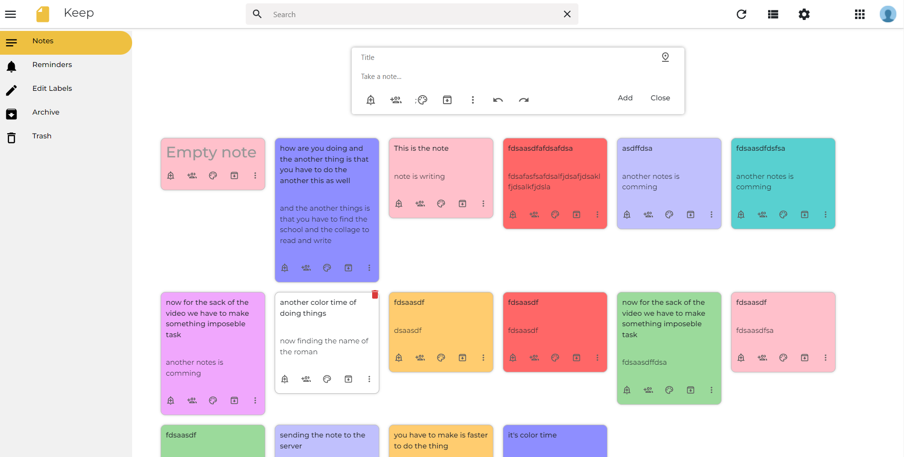

[<h1 style="font-size:60px; width:100%;">Keep-Notes</h1>](./appIcon.png)

## Note Taking Application for Better Productivity

## UI Interface:

## Technology Used:
    1. ReactJS : For Client Site
    2. Node/Express : For Server Site
    3. MongoDB : To Store User Notes

## Run It Locally:

### Node:
 1. `Keep-Notes`
 2. Create .env file in Root Directory
 3. Get all the environment variables which are include in .env.example
 4. Run `npm i` / `yarn` to install all packages
 5. Run `node src/index.js`

### React:
1. `Mvstreamer/client/web`
2. Run `npm install` to install all packages
3. Run `npm start` to run the server
